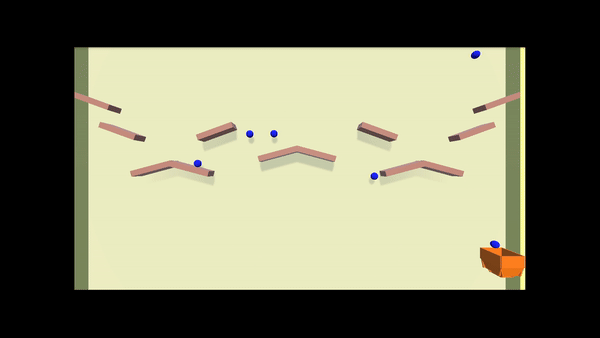

# Bucket Game (Catch Game)

  

## Description

This is a game where the objective is to catch balls that sporadically fall from the sky using a bucket. It was developed to understand how scripts function for different features within Unity. The scripts include functionalities such as: Player Control, Scoring System, Health System, Game Over System, and Random Ball Generator.

Link to play: https://play.unity.com/en/games/cb066034-5e35-422c-9248-1826ffc22ccc/webgl-builds

## Game Mechanics

The main goal of the game is to catch as many balls as possible without losing all lives. The player starts with three lives, and if they reach 0, the game stops generating balls and scoring. Blue balls represent 1 point, and red balls represent 2 points, but they also reduce the player's life if not caught. Although the score is not visually displayed, it is counted and shown in the 'Console'.

## Controls

To move the bucket, use the arrow keys (left and right). If you want to accelerate the player's movement, hold the shift key together with the direction you want to go.
